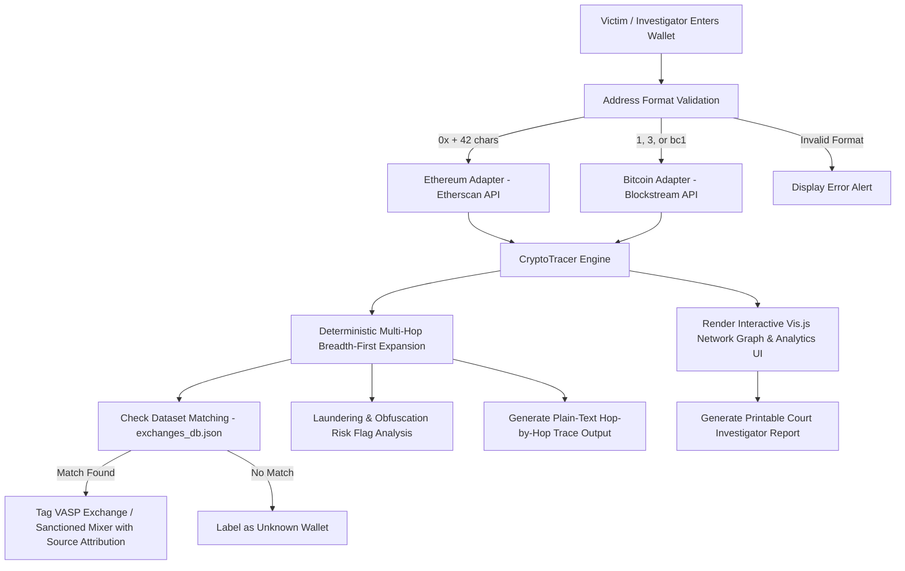

# Project Context & Complete Documentation

## 📍 Local File Location on Computer
The root directory of this project is located on your computer at:
`C:\Users\Admin\OneDrive\Desktop\crypto sih`

---

## 🚀 Overview & Mission

**Project Name:** Real-Time Crypto Fraud Wallet Tracer  
**Problem Statement:** Smart India Hackathon (SIH) 2026 - Problem Statement #26183  
**Target Organization:** Ministry of Home Affairs (MHA) / Indian Cyber Crime Coordination Centre (I4C) & National Cyber Crime Reporting Portal (NCRP) / SAHYOG Endpoint Integration.

### Core Mission
Provide cybercrime investigators and law enforcement agencies (LEAs) with an automated, deterministic multi-hop blockchain analytics engine to trace stolen cryptocurrency funds across Ethereum (ETH) and Bitcoin (BTC) ledgers, identify target Virtual Asset Service Providers (VASPs / Centralized Exchanges), detect laundering patterns (such as rapid automated layering and fan-out fund splitting), and issue automated freeze notices.

---

## 🛠️ Technology Stack

| Layer | Technology / Library |
| :--- | :--- |
| **Backend Framework** | Python 3, Flask (`app.py`), Flask-CORS |
| **Graph Analytics Engine** | NetworkX (`tracer.py`) |
| **Blockchain API Adapters** | Etherscan API V2 (Ethereum), Blockstream REST API (Bitcoin) |
| **Frontend UI** | HTML5, Vanilla CSS3 (Glassmorphism & Dark Mode), Vis.js Network |
| **VASP Dataset Engine** | Local JSON database (`exchanges_db.json`) with strict source attributions |
| **Production Server** | Gunicorn (via `Procfile` / `render.yaml`) |

---

## 📁 Repository File Structure

```
C:\Users\Admin\OneDrive\Desktop\crypto sih\
├── app.py                  # Flask Backend Web Server & REST API Endpoints
├── tracer.py               # Multi-Hop Graph Tracing Engine & Plain-Text Output Generator
├── adapters.py             # Blockchain API Adapters (Ethereum & Bitcoin Address Detectors)
├── exchanges.py            # VASP Identification Engine & Dataset Matcher
├── exchanges_db.json       # Verified Dataset of Exchanges & Mixers with Source Attributes
├── templates/
│   └── index.html          # Web Dashboard UI with Vis.js Graph & Plain-Text View
├── requirements.txt        # Python Project Dependencies
├── Procfile                # Heroku/Render Start Command Configuration
├── render.yaml             # Render.com Deployment Blueprint
├── README.md               # Quick Start Guide & Free Hosting Instructions
├── PROJECT_CONTEXT.md      # Full Architectural & Technical Context Document
└── SIH_Sample_PPT_PVPP.pdf # SIH Presentation Deck Reference
```

---

## ⚡ How the System Works (Step-by-Step Workflow)



1. **Intake & Auto-Routing:** The investigator pastes a wallet address into the search box. The system instantly detects whether it is an Ethereum address or Bitcoin address based on format rules.
2. **Blockchain Data Fetching:** The system queries live public ledgers (Etherscan V2 for Ethereum, Blockstream for Bitcoin) to retrieve outgoing transactions from the suspect wallet.
3. **Deterministic Multi-Hop Graph Traversal:** Starting at Hop 1, the engine recursively expands outgoing payment paths up to the user-configured hop depth (1 to 4 hops). Addresses at each depth level are sorted deterministically before fetching, ensuring 100% reproducible graph results.
4. **VASP Identification & Dataset Lookup:** Every recipient address is checked against `exchanges_db.json`. If a wallet matches a verified exchange hot wallet (e.g. Binance, WazirX, Coinbase, Bitfinex) or sanctioned mixer (Tornado Cash), it is tagged with its name and exact dataset source (`source: tradezon/cex-list` or `source: etherscan/label-cloud`). Unlisted addresses are strictly labeled `"Unknown wallet"`.
5. **Pattern & Risk Detection:** Algorithms check for suspicious laundering behavior, including:
   - **Fan-Out Fund Splitting:** Rapidly splitting funds across 4 or more distinct destination wallets.
   - **Rapid Automated Layering:** Sequential transfers executed within 15 minutes of each other.
   - **Mixer Interaction:** Direct routing of funds into privacy mixers/tumblers.
6. **Plain-Text Trace & Visual Rendering:** The backend constructs both an interactive Vis.js network graph and a plain-text transfer ledger (`Hop N: [Address A] sent [Amount] to [Address B]`).
7. **Legal Report Generation:** The investigator can generate an official court-ready intelligence report with SAHYOG evidence payloads for issuing freeze notices.

---

## 🖥️ Screen Elements & UI Prototype Breakdown

Below is a detailed breakdown of every component visible on the prototype dashboard (`http://127.0.0.1:5000`):

```
+---------------------------------------------------------------------------------------------------+
|  [I4C / MHA]  Crypto Fraud Wallet Tracer                                      [ Court Report ]   |
+---------------------------------------------------------------------------------------------------+
|                                                                                                   |
|                                Trace Victim-Reported Suspect Wallet                               |
|                     Auto-routes to Etherscan (ETH) or Blockstream (BTC) ledgers                       |
|                                                                                                   |
|  [ Address Input Field...                              ] [ Trace Flow ]                           |
|  Chain Routing: [ Ethereum (ETH) ]   [x] Stop at Exchange VASP   Max Depth: [3] Hops --------------|
|  Quick Test Addresses: (Ethereum Vitalik)  (Ethereum WazirX)  (Bitcoin SamSam)                    |
|                                                                                                   |
+------------------------------------------------------------+--------------------------------------+
|  Transaction Flow Network Graph                            |  VASP Identification    [HIGH RISK]  |
|  [ Show trace as text ]               Chain: Bitcoin (BTC) |  ----------------------------------  |
|  +------------------------------------------------------+  |  Unique Wallets   Transfers Traced   |
|  |                                                      |  |        32                 32         |
|  |          (Diamond: Origin Suspect)                   |  |  ----------------------------------  |
|  |                    |                                 |  |  Identified Recipient Exchanges:     |
|  |         +----------+----------+                      |  |  [Icon] Bitfinex BTC Deposit Hub     |
|  |         |                     |                      |  |         source: tradezon/cex-list    |
|  |    (Blue Dot)             (Green Star)               |  |  [Icon] Kraken BTC Deposit Hub       |
|  |  Unknown Wallet          Binance VASP                |  |         source: tradezon/cex-list    |
|  |                                                      |  |  ----------------------------------  |
|  +------------------------------------------------------+  |  Risk Flags                          |
|  Legend: (Gold) Suspect | (Blue) Unknown | (Green) Exchange|  |  [HIGH] Fan-Out Fund Splitting       |
|          (Red) Privacy Mixer Contract                   |  |  [MEDIUM] Rapid Automated Layering   |
+------------------------------------------------------------+--------------------------------------+
```

### 1. Top Header Navbar
- **`I4C / MHA` Badge:** Highlights official agency branding (Indian Cyber Crime Coordination Centre / Ministry of Home Affairs).
- **Title & Subtitle:** Displays the problem statement name (*SIH Problem Statement 26183 • Real-Time VASP Identification Engine*).
- **`Court Report` Button:** Opens the **Investigator Intelligence Report Modal**, generating a formatted document complete with timestamp, target exchanges reached, risk scores, and SAHYOG legal freeze alert payloads ready to print for legal filings.

### 2. Hero Control Box (Search & Settings)
- **Wallet Input Field:** Text box where investigators paste suspect addresses (`0x...` for ETH, `1...`, `3...`, `bc1...` for BTC).
- **`Trace Flow` Button:** Submits the wallet address and executes the multi-hop trace.
- **`Chain Routing` Badge:** Live auto-detection pill badge. Changes color and text dynamically as the user types (Blue for Ethereum, Amber for Bitcoin, Red for Invalid).
- **`Error Alert` Banner:** Displays immediate validation feedback if an invalid or unrecognized address format is entered.
- **`Stop at Exchange VASP` Toggle Checkbox:** When checked, prunes traversal immediately upon hitting a custodial exchange. When unchecked, traces the full multi-hop path regardless of exchange nodes.
- **`Max Depth` Slider:** Interactive range slider allowing the investigator to select between 1 and 4 hop depths.
- **`Quick Test Address` Chips:** Preset buttons to instantly test sample benchmark cases:
  - *Ethereum (Vitalik)* — Traces Vitalik Buterin's public wallet.
  - *Ethereum (WazirX Target)* — Traces an exchange deposit flow.
  - *Bitcoin (SamSam Ransomware OFAC)* — Traces the infamous SamSam ransomware wallet.

### 3. Main Network Graph Card (Left Side Visual Canvas)
- **Graph Header:** Displays the title and active chain indicator badge.
- **`Show trace as text` Toggle Button:** Switches the view between the visual network graph and a monospaced **Plain-Text Trace Output Box**.
- **Collapsible Plain-Text Trace Box:** Shows every hop line by line (`Hop N: [Address A] sent [Amount] BTC to [Address B]`). Includes a **`Copy Trace`** button for copying trace lines directly into case files.
- **Interactive Vis.js Network Canvas:** Drag-and-drop interactive canvas visualizing wallets as nodes and fund transfers as directed arrows:
  - **🔶 Gold Diamond Node:** Origin victim intake wallet address.
  - **🔵 Blue Circle Nodes:** Unknown/intermediary recipient wallets.
  - **⭐ Emerald Green Star Nodes:** Matched custodial exchange VASPs (Binance, Coinbase, Bitfinex, WazirX, etc.).
  - **🔺 Red Triangle Nodes:** Sanctioned privacy mixers/tumblers (Tornado Cash).
  - **Directed Edge Arrows:** Lines showing transaction flow direction, currency, and amount.
  - **Rich Hover Tooltips:** HTML popups displaying node type, full wallet address, hop depth, dataset source (`source: tradezon/cex-list`), jurisdiction, KYC status, and recommended action (*Issue SAHYOG Freeze Notice*).
- **Graph Legend Bar:** Bottom key summarizing node color meanings.

### 4. VASP Identification & Analytics Panel (Right Sidebar)
- **`Risk Level` Badge:** Top badge indicating overall laundering risk level (`CRITICAL`, `HIGH`, `MEDIUM`, `LOW`).
- **Stat Counter Boxes:**
  - **Unique Wallets:** Total number of distinct wallet nodes identified in the graph.
  - **Transfers Traced:** Total number of individual fund transfer edges analyzed.
- **Identified Recipient Exchanges List:** Card view listing every custodial exchange reached, displaying its logo icon, exchange name, jurisdiction, KYC requirements, and dataset source attribution.
- **Risk Flags Container:** Scrollable list displaying automated laundering alerts triggered during analysis (e.g., *Fan-Out Fund Splitting*, *Rapid Automated Layering*, *Mixer Interaction*).

### 5. Investigator Intelligence Report Modal
- Pop-up modal containing a structured evidence overview:
  - Report timestamp & origin wallet details.
  - VASP Identification & target exchange list for urgent freeze notices.
  - Risk & obfuscation flag breakdown.
  - Summary metrics.
  - **`Print` Button:** One-click print function to save the report as PDF or print hard copies for court presentation.

---

## 💻 How to Run & Test Locally

1. **Open Terminal / Command Prompt** in the project folder:
   ```cmd
   cd "C:\Users\Admin\OneDrive\Desktop\crypto sih"
   ```

2. **Start the Flask Development Server:**
   ```cmd
   python app.py
   ```

3. **Access in Browser:**
   Open your browser and navigate to:
   👉 **[http://127.0.0.1:5000](http://127.0.0.1:5000)**

---

## 🎯 Key Design Principles

1. **No Invented Labels:** Only real, verified dataset entries are named; all unlisted wallets are designated as "Unknown wallet".
2. **100% Deterministic:** Repeated traces with identical inputs yield identical node counts, edge counts, and graph structures.
3. **Investigation Ready:** Features a built-in court evidence report generator and plain-text output mode for instant validation against raw block explorers.
